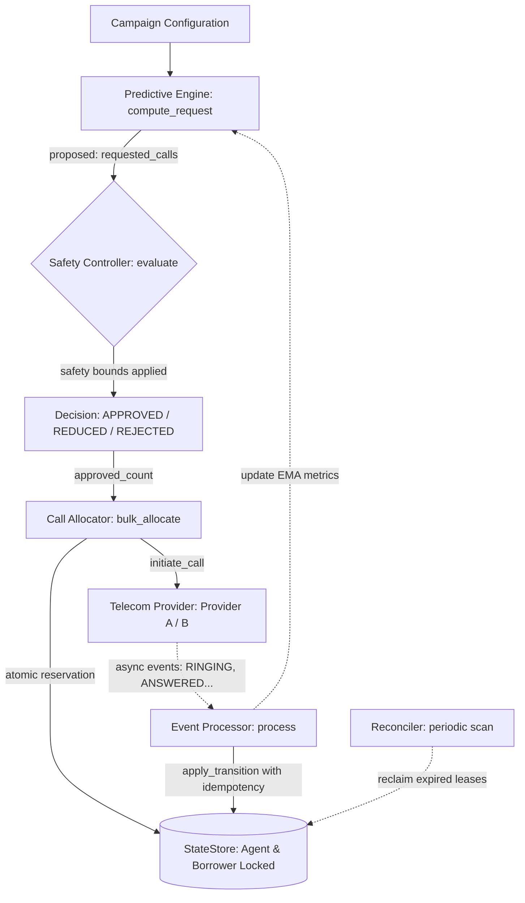

# SmartDialer Architecture

## 1. Problem Statement

A collections call centre has:
- **Agents** — employees waiting to talk to borrowers.
- **Borrowers** — people who owe money, to be called.
- **Campaigns** — batches of borrowers to be dialled in a session.
- **Providers** — telephony APIs (Provider A: reliable; Provider B: chaotic).

The dialler must decide:
1. **How many calls to start** — enough to keep agents busy, not so many that they abandon.
2. **Which agent to assign** — atomic reservation, no double-booking.
3. **Which borrower to call** — priority-ordered, no retry of in-progress contacts.
4. **When it is safe to dial** — respecting hard limits, provider health, and circuit state.

---

## 2. Pipeline

The system enforces a strict, linear decision pipeline:



```
┌────────────────────────────────────────────────────────────┐
│                      DIALLING CYCLE                        │
│                                                            │
│  PredictiveEngine.compute_request(campaign)                │
│        │                                                   │
│        │  requested: int (how many new calls?)             │
│        ▼                                                   │
│  SafetyController.evaluate(requested, campaign, provider)  │
│        │                                                   │
│        │  approved: int (≤ requested, may be 0)            │
│        ▼                                                   │
│  CallAllocator.bulk_allocate(requests[:approved], provider)│
│        │                                                   │
│        │  initiate_call(call, event_callback) per call     │
│        ▼                                                   │
│  TelecomProvider  ← ← ← ← ← ← ← ← ← ← ← ← ← ← ← ←     │
│        │  (async event delivery, background thread)        │
│        ▼                                                   │
│  EventProcessor.process(ProviderEvent)                     │
│        │                                                   │
│        │  call.apply_transition(new_state, event_id)       │
│        ▼                                                   │
│  StateStore  (single source of truth)                      │
└────────────────────────────────────────────────────────────┘
```

**Invariant**: The PredictiveEngine has no reference to the provider and no reference to the allocator. `compute_request()` accepts only a `Campaign`. The only route from the engine's output to a live call is through the SafetyController.

---

## 3. Component Descriptions

### 3.1 StateStore (`app/repository/state_store.py`)

The in-memory repository. Designed so that every public method maps to a single SQL statement:

| Method | SQL equivalent |
|--------|---------------|
| `atomic_reserve_agent(id, reservation_id, lease)` | `UPDATE agents SET state='RESERVED', reservation_id=?, lease_until=? WHERE id=? AND state IN ('AVAILABLE','PAUSED')` |
| `atomic_reserve_borrower(id, reservation_id)` | `UPDATE borrowers SET status='RESERVED', reserved_by=? WHERE id=? AND status='PENDING'` |
| `find_expired_reservations()` | `SELECT * FROM calls WHERE lease_until < NOW() AND state NOT IN ('COMPLETED','FAILED','CANCELLED')` |
| `release_agent(id)` | `UPDATE agents SET state='AVAILABLE', reservation_id=NULL, lease_until=NULL WHERE id=?` |

**Locking model (in-memory):**
- Per-entity-type lock (`_agents_lock`) — held briefly for list snapshots.
- Per-row lock (`_agent_row_locks[agent_id]`) — held for the check-and-set in `atomic_reserve_agent`.
- No global lock is ever held during provider I/O.

**PostgreSQL upgrade path:** Replace the in-memory dicts with a SQLAlchemy session. The per-row lock becomes `SELECT FOR UPDATE`. The `find_expired_reservations` method becomes a query. All callers remain unchanged.

---

### 3.2 CallAllocator (`app/dialer/allocator.py`)

Executes a single approved call in nine steps:

```
1. Provider health guard         → fail-fast, no reservation yet
2. Generate reservation_id       → shared UUID ties agent + borrower + call together
3. atomic_reserve_agent()        → check-and-set with row lock
4. atomic_reserve_borrower()     → check-and-set; rollback agent on failure
5. Create Call (QUEUED state)
6. call.apply_transition(RESERVED)
7. Link agent to call
8. Persist call + agent          → crash-safe: reconciler can find and clean up
9. provider.initiate_call()      → on failure: mark FAILED, release all
10. Transition call→INITIATED, agent→DIALING
```

Between steps 8 and 9, the system survives a worker crash cleanly: the reservation is persisted, the lease has a deadline, and the reconciler will find and cancel it.

**`bulk_allocate()`** calls `allocate()` in a loop. Each allocation is independent; a failure in one does not abort the others.

---

### 3.3 ProgressiveDialer (`app/dialer/progressive.py`)

Simple 1:1 mode. In each cycle:
1. Snapshot available agents.
2. Snapshot dialable (PENDING) borrowers, sorted by priority.
3. Pair them up (1 agent → 1 borrower).
4. Cap at `max_per_cycle` (prevents runaway on large campaigns).
5. Delegate each pair to `CallAllocator.allocate()`.

No EMA, no overdialling. Used as a baseline and a fallback when the circuit breaker is HALF_OPEN.

---

### 3.4 PredictiveEngine (`app/dialer/predictive.py`)

Uses EMA (Exponentially Weighted Moving Average) to estimate the current answer rate and compute how many calls to start:

**EMA update (called after each call outcome):**
```
new_rate = alpha * observed + (1 - alpha) * prev_rate
```
- `alpha = 0.15` — low alpha → slow adaptation (stable); high → fast adaptation (noisy).
- `observed = 1.0` if the call was answered, `0.0` if not.

**Call request formula:**
```
target_inflight = ceil(available_agents / answer_rate)
cap             = floor(available_agents * max_calls_per_agent)
target_inflight = min(target_inflight, cap)
new_calls       = target_inflight - currently_inflight
new_calls       = min(new_calls, available_agents)   # self-cap
new_calls       = max(new_calls, 0)
```

**No provider reference.** `compute_request(campaign)` takes only a Campaign. This is enforced by design and tested explicitly.

---

### 3.5 SafetyController (`app/safety/controller.py`)

The final authority on call count. Evaluates in seven steps:

```
1. Requested == 0?             → REJECT (nothing to do)
2. Circuit breaker OPEN?       → REJECT (provider unreachable)
3. Circuit breaker HALF_OPEN?  → FALLBACK_PROGRESSIVE (probe mode)
4. Provider unhealthy?         → REJECT
5. Count available agents
6. Compute safe_capacity:
       safe = min(
           available_agents,
           campaign.max_concurrent_calls - inflight,
           global_max - inflight
       )
7. requested <= safe?          → APPROVE(requested)
   requested > safe?           → REDUCE(safe)
   safe == 0?                  → REJECT
```

`decision_log` captures every evaluation with timestamp, requested count, approved count, available agents, and inflight calls. Useful for audit and debugging.

---

### 3.6 CircuitBreaker (`app/safety/circuit_breaker.py`)

Per-provider. Tracks provider health across calls:

```
CLOSED ─(failures ≥ threshold)─→ OPEN
OPEN   ─(cooldown elapsed)─────→ HALF_OPEN
HALF_OPEN ─(probe success)─────→ CLOSED
HALF_OPEN ─(probe failure)─────→ OPEN
```

**HALF_OPEN probe logic:** Only one thread may attempt the probe call. `is_call_permitted()` atomically claims the probe slot and flips the state to prevent concurrent probes.

`force_open()` and `force_close()` are available for testing and operational override.

---

### 3.7 TelecomProvider (`app/providers/interface.py`)

Abstract base class with two methods:
- `is_healthy() → bool`
- `initiate_call(call, event_callback) → bool`

**Provider A** (`provider_a.py`): Reliable. Delivers events in order in a daemon thread. `delay_scale` parameter multiplies all delays — set to 0 for instant synchronous test delivery.

**Provider B** (`provider_b.py`): Chaotic. Delivers events with configurable:
- `duplicate_probability` — same `event_id` sent N times.
- `out_of_order_probability` — event sequence is shuffled before delivery.
- `timeout_probability` — COMPLETED is never sent.
- `inject_duplicate()` and `inject_out_of_order()` — for precise test scenarios.

---

### 3.8 EventProcessor (`app/events/processor.py`)

Receives `ProviderEvent` objects from provider daemon threads. For each event:

1. Look up the call by `event.call_id`.
2. Map `event.event_type` string → `CallState` enum.
3. Call `call.apply_transition(new_state, event_id=event.event_id)`.
   - Returns `True` if the transition was applied.
   - Returns `False` if duplicate (event_id seen before) or out-of-order (rank ≤ current).
4. Persist the call.
5. On terminal state: update agent (WRAP_UP or AVAILABLE), update borrower (COMPLETED or PENDING), notify pacing engine.

The processor is stateless between events. Multiple provider threads can call it simultaneously.

---

### 3.9 Reconciler (`app/dialer/reconciler.py`)

Periodic crash-recovery job. Finds calls with expired leases:

```python
expired = store.find_expired_reservations()
# Returns calls where: lease_until < now AND state NOT IN terminal states
```

For each expired call:
- `QUEUED / RESERVED` → mark `CANCELLED` (never reached provider), release agent + borrower.
- `INITIATED / RINGING` → mark `FAILED` (provider was contacted), release agent + borrower.
- `ANSWERED / CONNECTED` → log warning, **do not kill** (live conversation).

Idempotent: if two reconciler instances race on the same call, the second one finds the call already terminal and skips it (`apply_transition` returns `False` for duplicate event_id).

---

## 4. Threading Model

```
Main thread          Provider A thread       Provider B thread
(dialling cycle)     (per call)              (per call)
     │                    │                       │
     │ allocate()         │                       │
     │ ──────────────────►│ daemon thread start    │
     │                    │ sleep(ring_time)       │
     │                    │ emit(RINGING)          │
     │                    │ ──── event_callback ──►│
     │                    │                  processor.process()
     │                    │                  call.apply_transition()
     │                    │                  store.save_call()
     │                    │                       │
     │ sleep(cycle_interval)                      │
     │ reconciler.run()   │                       │
     │ next cycle         │                       │
```

All store mutations go through `threading.Lock`. No global lock is held during I/O or sleep.

---

## 5. Data Model

```
Campaign ──── has many ──── Borrower
                                │
Agent ──── assigned to ──── Call ◄──── ProviderEvent
                                         (event_id, event_type, call_id)

Call.processed_event_ids: Set[str]   ← idempotency guard
Call.state: CallState                ← monotonically advancing rank
Call.version: int                    ← incremented per applied transition
Call.lease_until: datetime           ← lease for crash recovery
```

---

## 6. Scalability Reasoning

This prototype uses a single in-memory process. In a production deployment:

| Concern | This prototype | Production path |
|---------|---------------|-----------------|
| State store | In-memory dict | PostgreSQL with `SELECT FOR UPDATE` |
| Concurrency | `threading.Lock` | DB row-level locks |
| Worker scaling | Single thread | Multiple dialling workers, each reads from queue |
| Provider events | Daemon threads | Webhook endpoint → Celery task → event processor |
| Reconciler | In-process | Separate cron job or scheduled Celery beat |
| Circuit breaker | Per-process | Shared state in Redis or DB |
| Metrics | In-memory list | Time-series DB (e.g., Prometheus) |

The key insight is that the abstraction boundaries in this prototype are exactly where you would insert the distributed infrastructure. The `StateStore` interface already matches what PostgreSQL would provide. The `TelecomProvider.initiate_call` signature already matches a webhook acknowledgement model.
